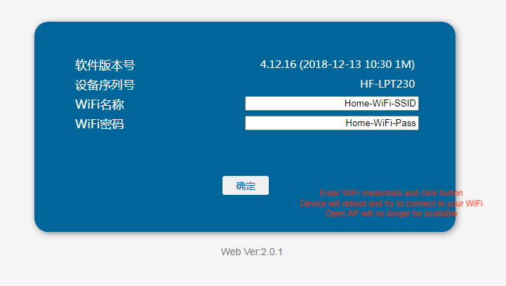

# iCar OBD WiFi
I needed to make the EV battery state of charge % from my vehicle accessible programatically to allow smart charging.  

## Vgate iCar Pro WiFi

The [Vgate iCar 2 WiFi](https://www.vgatemall.com/products-detail/i-14/) is [available on eBay]((https://www.ebay.co.uk/itm/315178202059) for ~£16 (or AliExpress for less).  It plugs into the ODB2 port of the vehicle and is small and unobtrusive enough to leave plugged in inside the car permanently.

Internally it consists of: 

1. ELM327 ODB to RS232 interpreter ([manual](https://www.elmelectronics.com/DSheets/ELM327DSH.pdf))
2. [Hi-Flying LPT230](http://www.hi-flying.com/hf-lpt230) UART to WiFi module - 1MB flash version ([manual](https://fccid.io/2ACSV-HF-LPT230/User-Manual/Users-Manual-3552381.pdf))

Out of the box the LPT230 is configured as an AP broadcasting an open network with SSID “V-LINK”.  After connecting to the WiFi network the LPT230 is 192.168.0.10 and its TCP port 35000 provides transparent bi-directional access to the RS232 side of the ELM327.

## LPT230 Configuration

Considering that the vehicle OBD2 port is writable, I don’t want the iCar plugged in permanently broadcasting an open WiFi network.  

The 1MB flash version of the LPT230 unfortunately does not have a full web interface but it is sufficient to change WiFi configuration to station mode to have the LPT230 connect to your home WiFi instead of it being an open AP.  Whilst connected to the V-LINK WiFi open a web browser to http://192.168.0.10, username "guest”, password “&^)@@)” (obtained using AT+WEBU):



Using the web interface method above only the WiFi mode is changed so the LPT230 remains as a TCP server on port 35000 of whatever IP your DHCP server gives it.  To change any other configuration Hi Flying offer a [Windows/Android tool](http://www.hi-flying.com/download-center-1/applications-1/download-item-wifi-config-tools-v1-0) which will send any of the AT commands documented in the manual above to the MAC of the LPT230.  Options are available to configure it as an AP with WPA2 security and/or have it be a TCP or UDP client that sends data to a socket on your home server.


If at any point you loose network access to the LPT230 you must open up the iCar 2 and jumper together pins 12 (nReload) and 16 (Gnd) of the LPT230 for 4 seconds after which the default configuration (open WiFi network) will return.


## ELM327 Configuration

The iCar 2 will turn off WiFi when ELM327 enters lower power mode (out of the box this is after 20 mins inactivity) and can then only be awoken by pressing the power button on it.  The Programmable Parameters (PP) section of the ELM327 manual documents all configuration options including PP 0E - a bitmap of power control options.

Using @dailab’s [fork of python-OBD](https://github.com/dailab/python-OBD-wifi/tree/master) (which connects to ELM327 over TCP instead of serial port) disable the low power functions:

```python
import obd

icar = obd.OBD("192.168.1.134", 35000)  # IP of LPT230 on network

elm327 = icar.interface

# Out of the box my iCar had FA at PP0E (11111010), toggle first bit to 
# disable all low power (01111010 = 7A)
elm327.send_and_parse(b"ATPP0ESV7A")

# Save the new setting, takes effect after power cycle
elm327.send_and_parse(b"ATPP0EON")
```

The iCar 2 now stays on permanently and connects to my home WiFi when the car arrives home and is in range of my WiFi.

## Communicating with the vehicle

My use case is to fetch EV battery state of charge but you could read any parameter you know the OBD2 PID for.

```python
import obd

from obd.OBDCommand import OBDCommand
from obd.decoders import percent
from obd.protocols import ECU

icar = obd.OBD("192.168.1.134", 35000)

# Command specification for ODB PID 015B
battery = OBDCommand("BATTERY_LEVEL", "Battery Level", b"015B", 3, percent, ECU.ENGINE, True)

response = icar.query(battery)

print(f"Battery level: {response.value}")
```

For my vehicle (2021 Range Rover Velar PHEV) certain parameters including EV state of charge seem to be always accessible whilst others (everything related to the ICE) become inaccessible a few minutes after the ignition is turned off.
